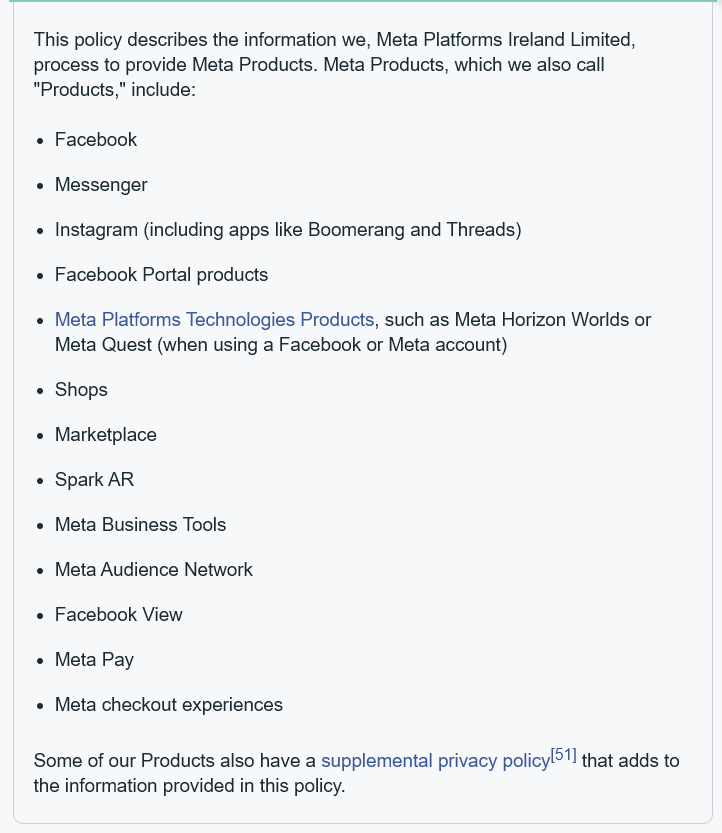
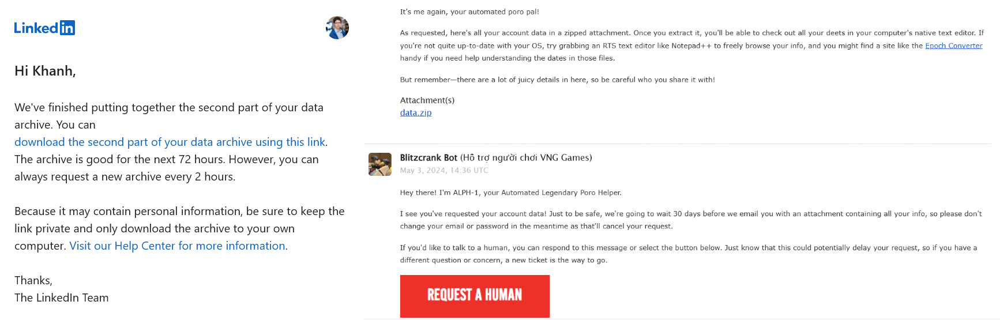
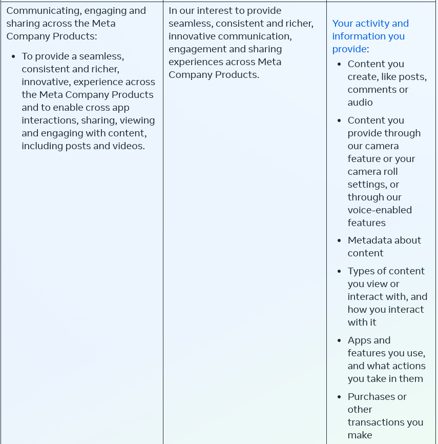
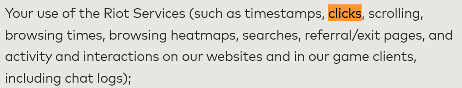
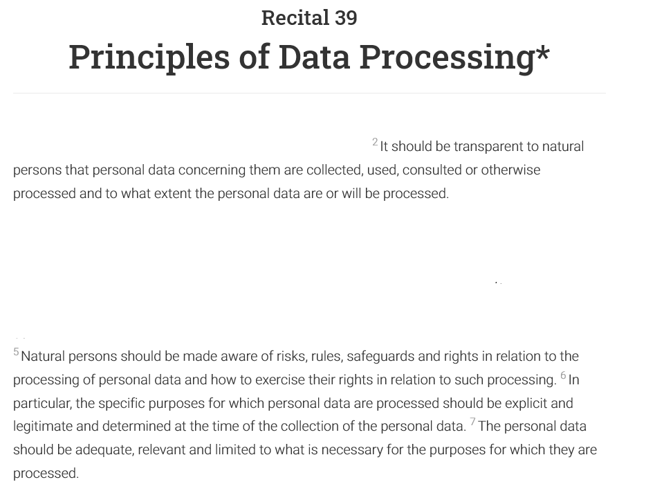
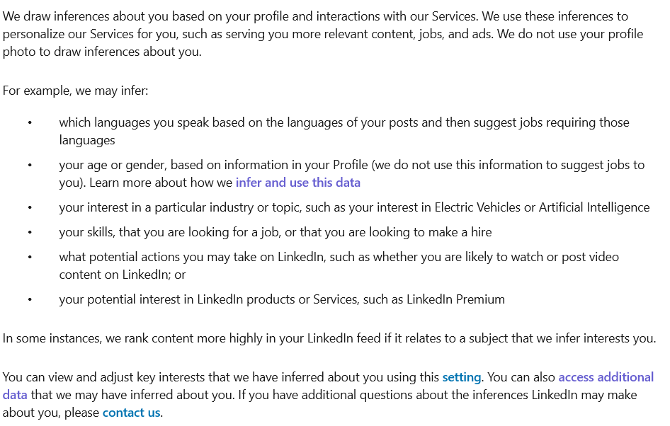
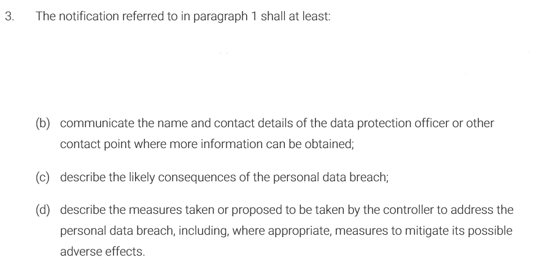

<style>
.figure .caption {
  color: red;
}
</style>

```{r setup, include = FALSE, message=FALSE, warning=FALSE}
knitr::opts_chunk$set(echo = TRUE)

library(tidymodels)
library(tidyverse)
library(knitr)
library(DT)

load("Processed_Data/process_data_LinkedIn.RData")
load("Processed_Data/process_data_Facebook.RData")
load("Processed_Data/process_data_RiotGames.RData")
```

# Introduction

In this report, we are focusing on three platforms: Facebook, LinkedIn and Riot Games (specifically through their game title League of Legends). These platforms have different business model and services, varying amount of information available about users, and different (perceived) degrees of protection for user data privacy. What they have in common, however, are their large userbase that use the platform frequently.

Facebook is a social media and social networking platform, a sub product owned by conglomerate Meta, that was created in 2004. As of end of 2023, the platform has around 3.07 billion monthly active users (Meta, 2024a). Originally created to connect students (and later people) and blog-sharing, Facebook has evolved to encapsule a variety of services, from livestreaming, gaming, dating, marketplace, groups or communities, and more. The platform is also capable of using information from other parent-company product, most notably Messenger (insta-messaging app) and Instagram (media-centric social platform, see figure 1 below) – meaning that the platform can leverage a vast amount of inter-connected user data for operations and earning revenue through advertisements.

```{r, message=FALSE, echo=FALSE, warning=FALSE, fig.cap="Figure 1: Products by Meta, in which the personal data can be shared between platforms with user consent", out.width="40%", out.height = "1%", fig.align="center"}

```

Despite this, Facebook has also been notorious for serious violations of user privacy and unauthorized data access from third-parties – often without the knowledge of the users themselves. Past response of the company has not always been compliant, as they knew about the data theft from Cambridge Analytica but did not do anything to prevent such accident, or deferring responsibility between its governing entities when ruled unfavourably (Newcomb, 2018). Specifically under GDPR, Facebook and its parent company Meta has been fined multiple times for violating the data protection law (Fortra, 2023).

LinkedIn is a employment-focused social media platform, which connects employees together for professional networking or development, and employees to employers who are looking for hire. The platform was bought in 2016 by Microsoft, and has since been operated as a separate subsidiary of the conglomerate. There are 900 million users worldwide, of which a third of them are active monthly users (Bondar, 2024). Unlike Facebook, the primary revenue source of LinkedIn comes from subscription, in which they act as “data broker” to give employees and employers tips, insights and unrestricted access. Advertisements continue to be a source of revenue for the platform, albeit not as significant.

According to a report by eMarketer, Inc (2020), LinkedIn was reported by U.S users to be the most trustful among the social media platforms in 2020. At the same time, it is also facing potential fines due to GDPR violations related to target advertising dating back to 2018, although the lawsuit is still in disrepute. And while its privacy policy does not outright mention data sharing to a third party, its association with Microsoft has raised concerns about whether data is also being accessed by other Microsoft applications (Presearch, 2018). Overall, while not having track record as Facebook for violating data privacy, LinkedIn also raises eyebrows about the extent it protects and safeguards user privacy.

Finally, Riot Games is an American game developer and publisher, with headquarter in California, the USA. Having published its first game in 2008, currently the company has 132 million active monthly users – also the largest within the online and PC gaming community. In this report we focus on its data privacy practices in the inaugural and most popular game title, League of Legends (LoL, although other game titles have similar privacy policies). For the game, Riot’s main source of revenue comes from selling in-game products and items, as well as esports partnership with other brands. Both of these activities do not involve personalized advertising activities, meaning that Riot Games does not leverage user data as much as platforms that do have advertising like Facebook or LinkedIn. This, however, does not rule out the possibility that the company uses user data for internal purposes like segmenting or profiling, in relation to esports behaviour or selling products. As of 2024, Riot Games has never been found to be in active violation of data privacy, and no signs of a violation has been shown yet.

Within the scope of this report, we only focus on the practices and information available on the platforms’ European counterpart, which are Meta Platforms Ireland Limited, LinkedIn Ireland Unlimited Company, and Riot Games Ltd. Because their privacy notice are under the same GDPR and structure, difference in services – obtained information – data safeguard allows us to draw general comparisons/correlations between platforms. Specifically, we focus on how platforms of different sizes protect digital footprints of users.

# User perspective

## Subject data access

Each platform has a different process that the user has to go through, even before they can view available data. Facebook and LinkedIn provide a section on their prospective platform where the user can self-serve to choose which data to download, while Riot Games require users to fill in a form on their players support website page. Requesting data in all cases requires the user to login, but officially initiating the request to the platform and receive the data varied. For Facebook, once requested the data is immediately prepared to download (which takes around a day). On LinkedIn the link to download data will only be sent to the email associated to profile to download once it is ready. For Riot Games, the request will be reviewed and intentionally put on 30-day probation period, where an email or password change automatically cancels the request. After the period, a direct link to download LoL data will be sent to the associated email account. All data requests expire after 7 days as they should be.

```{r, message=FALSE, echo=FALSE, warning=FALSE, fig.cap="Figure 2: Additional steps to access personal data by LinkedIn and Riot Games", out.width="85%", out.height = "100%", fig.align="center"}

```

From an user perspective, given that the requested data is personal and sensitive, Riot Games showcased most effort in safeguarding against account abuse, followed by LinkedIn and Facebook. In the event that the account was personally hacked through knowing the password (targeted attack, different from data leaks or social engineering attacks), Facebook essentially hands over all data to the hacker – which is an invaluable tool for blackmailing or impersonation. LinkedIn requires the hacker to also have access to the recipient’s email, which is a lot harder unless the user set the same passwords. In Riot Game’s case, it is impossible since the hacker needs to also have sole, uninterrupted access over both the account and email a 30-day period. In personal cases described above, it is very likely that all platforms will reject to (or actually be able to) retract the data from the hacker, citing fault from the user that did not secure their account properly. But the intervention to prevent such worst case from happening is extremely strong for Riot Games, moderate for LinkedIn, and weak for Facebook.

## Location & IP Address

All three platforms collect IP Address users’ device used to connect to their services, specifically in the interest of their legitimate purposes. It is classified as personal data regarding use of platform service, and was used in various interest (that can roughly be categorized in figure 3 below):

```{r, message=FALSE, echo=FALSE, warning=FALSE, fig.cap="Figure 3: Legitimate purposes by platform that uses IP Address", out.width="60%", out.height = "60%", fig.align="center"}
include_graphics("Supplement_Media/Part2.2_Figure3.png")
```

For the purpose of collecting IP Address, some of the interests above are ambiguous – one such example is Business Analytics & Insights. Facebook suggest that such data is used “To understand, in aggregate, your usage of and across our Products, to accurately count people and businesses; and validate metrics directly related to these [...]”. Similar aggregation use by LinkedIn (titled as providing analytics and insights) is also mentioned. It is not clear why IP Address is used, in aggregation, to examine user’s use and headcount when the number of accounts and login time is enough for the purpose. Riot Games does not divulge which data it uses for each purpose, making it possible to use IP Address for any legitimate interests it mentioned and therefore even more confusing from user perspective.

What is more surprising, however, is the extent and utilization of IP Address. LinkedIn strictly only collects it when the user has to login on a new session on a new device:

```{r, message=FALSE, echo=FALSE, warning=FALSE, fig.cap="Dataset 1: Login IP logs LinkedIn records", out.width="50%", out.height = "50%", fig.align="center"}
datatable(linkedinLogins)
```
Meanwhile, Riot Games keeps a detailed track of IP Address even if the login is remembered on device. They also keep logs of when I purchased an item in the store. As a result, Riot Games IP log is extensive. The logs are indicative of when I opened the game, and can be used to infer my gaming behavior – something that I feel is unnecessary and not comfortable with. They can argue that it is for security measures, however I think an unauthorized purchase can already be detected by an unauthorized IP Address when logging in - and no need to collect IP address when purchasing.

```{r, message=FALSE, echo=FALSE, warning=FALSE, fig.cap="Dataset 2: Login IP logs Riot Games records", fig.align= 'center'}
datatable(riotGamesLocation)
```

```{r, message=FALSE, echo=FALSE, warning=FALSE, fig.cap="Dataset 3: Purchase IP logs Riot Games records", fig.align= 'center'}
datatable(riotGamesPurchaseLocation)
```

Finally, Facebook collects the IP Address AND infer my location (city, town, zipcode) to a degree that I am also not comfortable:

```{r, message=FALSE, echo=FALSE, warning=FALSE, fig.cap="Dataset 4: Login IP logs Facebook records", fig.align= 'center'}
datatable(facebookIpAddress)
```

```{r, message=FALSE, echo=FALSE, warning=FALSE, fig.cap="Dataset 5: Inferred location Facebook records", fig.align= 'center'}
datatable(facebookLocation)
```

I have never allowed location access by any Meta services, but the platform can still infer upto my zipcode only using my IP Address. The granularity and accuracy is unpleasantly surprising, although in March 2024 it suddenly jumps back to my old zipcode for a few days then back to my current even if I didn’t travel there.

## Interactions activity on platform 

Facebook has a lot, if not every single detail, about the activities that user do on the platform. For example, how much time a post or video appear on the user’s screen:

```{r, message=FALSE, echo=FALSE, warning=FALSE, fig.cap="Dataset 6: User activity and duration Facebook records", fig.align= 'center'}
datatable(facebookContentViewed)
```
These data are not only personal but also potentially sensitive, as people belonging to certain demographics, sexual orientations, communities are more likely to spend more time on a post (closely) related to them (e.g: Reading it, not scrolling past). Knowing that information like these is considered platform activity that can be used for various purposes including personalization, research, or legal request – and I cannot retract my consent for such potentially sensitive information, since they also fall under the category of necessary information needed to perform contractual obligations between me and platform – makes me wonder what measure they are taking to protect my data and well-being.

```{r, message=FALSE, echo=FALSE, warning=FALSE, fig.cap="Figure 4: An example of what Facebook does with my activity data, which is vague", out.width="50%", out.height = "70%", fig.align="center"}

```

LinkedIn also collect user interactions on their platform. Viewed, shared/reposted posts activity are recorded with less granularity than Facebook of whether such interaction happened (and not duration). LinkedIn also record (and let user access) messages on the platform – which is potentially sensitive, if user choose to disclose information about their gender/political opinion/health/religion. While the messages are not end-to-end encrypted as Facebook (meaning that nobody except recipients, even Facebook, can access message content, Meta, 2024b), the messages are by nature opt-in, and given the professional nature users are expected to not disclose such information. Similar to Facebook, such activities are also used for various legitimate interest like those outlined in Figure 2.

Finally, Riot Games collect the following interactions on their platform, but do not provide a copy for the user:

```{r, message=FALSE, echo=FALSE, warning=FALSE, fig.cap="Figure 5: Activities that Riot Games collect (automatically), which users cannot access", out.width="60%", out.height = "60%", fig.align="center"}

```

Because of that, we cannot assess the granularity. In detailing legal basis to process personal data, they have also grouped all data as one, therefore we can assume that they will use the information about interactions for all purposes similar to one outlined in Figure 2. However, there are no direct risks associated with using sensitive information in these interests, since there were no potential sensitive information among collected data in the first place. There is a very small risk coming from using third-party data from Facebook (in case users connect account with Facebook, with the risks mentioned in Facebook section), but such risk is minimal and almost never applicable.

# Manager Perspective

In this section, we examine which action is legally and ethically allowed by platforms that own user data. We will narrow the examples to the platforms that:

-   Has user perform activities on the platform, which may or may not be suggestive of their sensitive data (e.g: sexuality, ethnicity, religion, political opinions)
-   Has user consented to processing of said data & device data (particularly, IP address) for legitimate interests, including the option to opt-out as long as it does not interfere with contractual obligations of platform.
-   Is obliged to provide users access to their data in accordance with Article 15 of the GDPR, including the information outlined in Article 13 and 14 of the GDPR, in a manner consistent with recital 60.

## Example 1 (not legally allowed): Experimenting with users based on their activity on the platform, without the knowledge of the user themselves.

Experimentation here can involve technical changes (such as an A/B testing on functional, layout of platform), inferences/profiling, or social studies (field study in which the environment is dictated). In the latter case, Facebook already has some experience with it: In July 2014, they ran an experiment on mood-manipulation, with 500 thousands users having their newsfeed altered to show negative or positive news (Newcomb, 2018). The paper that published results has led to a debate within academia regarding ethics, ultimately resulting in the lead scientist apologizing (Newcomb, 2018). Fortunately for Facebook, this was before the time when GDPR come into effect.

It is not hard to see from business perspective why they could think this is a beneficial action to take. Field experiments offer valuable insights due to realistic environment they are being deployed into, if done correctly. For examples such as A/B testing, platforms can quickly adopt or revert the changes to results in real time; for social studies, the platform offers large and diverse participant pool that the platform can access for free. And if the users are aware such experiments are being done on their data, platforms like Facebook can argue that their activity is being used for a legitimate purpose like personalization, improving services, or research and societal good.

Such arguments, however, does not hold in front of GDPR and watchdogs. Experimentation on activities of the user on a platform naturally violates recital 39-2,5,6,7, within Article 6 (Lawfulness of Processing) in GDPR.

```{r, message=FALSE, echo=FALSE, warning=FALSE, fig.cap="Figure 6: Recital 39, with relevant extracts showing why experiments can be violation", out.width="50%", out.height = "70%", fig.align="center"}

```

In short, data subjects are not being informed transparently about which data of them are being collected and for which purposes, not being aware of the risks, rules, safeguards and rights in relation to processing of data, with explicit and legitimate purpose determined at the time of consent. From a scientifical perspective, experiment that allows the user to know any of the information above produces biased results and is therefore invalid – as such, either experimentation is done in a way that violates the GDPR, or it is not done properly.

The legitimate interest of the experiment will also be challenged, as per recital 47-4 the interests and fundamental rights of data subjects override the interest of data controller (offering better services and personalization). It can also be challenged if based on performance and contractual grounds, since experiments are not mandatory to offer services, even if it is not good. Finally, for aggravation, Facebook currently holds data about how long user spend time on posts, which can potentially be suggestive of sensitive data. Article 9, paragraph 1 of GDPR forbids processing sensitive data, and paragraph 2(a) does not apply since the nature of experiments often clash with users giving consent for such purposes (as mentioned above).

For these reasons, platforms have mostly moved away from experimenting directly with user behaviour on their platform. For A/B technical changes, platforms can trial new changes with user awareness and receive feedback, and only reserve the test for changes that involve anonymized user behaviour – which is allowed under Article 11, paragraph 1 of GDPR. Experimentation and inferences should be clearly communicated to users, similar to how LinkedIn dedicates a webpage to explain the purpose (2024)

```{r, message=FALSE, echo=FALSE, warning=FALSE, fig.cap="Figure 7: LinkedIn website (2024) explaining in specific how they are experimenting (drawing inferences) with user activity", out.width="60%", out.height = "75%", fig.align="center"}

```

## Example 2 (legally allowed, but potentially unethical): Take the maximum amount of legally allowed time to communicate, or does not communicate at all, about a low-risk personal data breach.

There are two practical cases of low-risk personal data breach appropriate for this example. The first one is small-scale breach, in which a small handful of users on the platform is hacked or impersonated on the platform. The second case is the breach of publicly available information that is being abused. Riot Games is currently facing this case (albeit in Korea jurisdiction, not Europe), where IP addresses of accounts are easily accessible through APIs for operating processes, but is being annoyingly abused for targeted DDOS attacks against professional players (see Fisher, 2024). In both cases, the platform can choose to not publicly announce about the breach, or take the longest amount of time possible to do so. In fact, under Korea jurisdiction Riot Games has never publicly acknowledged the hack, although individual workers have confirmed and were working on it.

Legally, the platform as controller is required by Article 24, paragraph 1 of GDPR to ensure that data processing – which includes the protection of personal data – is appropriate with the Regulation. In the cases of data breach, platforms are required by Article 33 & 34 to communicate to the user about high-risk data breach, including:

```{r, message=FALSE, echo=FALSE, warning=FALSE, fig.cap="Figure 8: From Article 34, paragraph 2: Minimal information that platforms need to communicate with users in case of data breach. Image from Article 33, paragraph 3.", out.width="60%", out.height = "75%", fig.align="center"}

```

However, Article 32, paragraph 2 of GDPR also dictates that the controller already has to assess the risks presented by processing (which includes unlawful destruction, loss, alteration, unauthorised disclosure of, or access to personal data). This forms the basis for platforms to opt-out of notification of data breach (such as IP Addresses) in the case described, if the risk is deemed low.

It can, however, be unethical in how platform decides what type of risk is low and/or whether they choose to communicate about the breach. For the former situation, while supervisory authorities have to agree on the risk assessment (Article 34, paragraph 4), reaching such decision might extend for long periods that the notification is rendered unhelpful. In the latter situation, when user learns that there was a data breach and their personal data was stolen – yet the platform did not notify them in anyway – they might feel distrusted and disappointed in the handling, resulting in worse reputation for the platform. The act of weighting between legal obligations and user-platform relationship to decide communication can also destroy the platform’s reputation in the eye of some users.

To avoid being put in ethically “awkward” situation, platforms can be proactive in both assessing the risks of processing data, and communication plan in case of issues/crisis. This should involve the legal team drawing up a contingency plan relative to the magnitude of risks, to determine whether the users will be informed.

## Example 3 (legal and ethical): Intentionally delay the right of users to access personal information, as a preventive measure against unauthorized access.

This example has already been done by Riot Games – with the little amount of personal information they hold about an user, they are deliberately taking the full one month (30 days) period to avoid unauthorized request. This is a very elegant design by the company, as it fully complies with GDPR’s Article 12, paragraph 3, in which the platform has to fulfil the right to access personal data (Article 15) within one month and without undue delay. It is data protection by design (Article 25), in which producers of the service that is based on data processing takes into account data protection and fulfil their data protection obligations (Recital 78-4). The concerns about undue delays or ethical concerns has been resolved by promptly informing the user about the reasons for the delay, as shown in the request email.

Overall, the practice shows appropriate security of personal data as required by Article 5, paragraph 1(f). Other companies should consider to adopt this practice – maybe not drawn out to a month like Riot Games, but taking into account security of data to implement safeguards appropriately.

# Conclusion

We have examined the personal data and digital footprints that Facebook, LinkedIn and Riot Games process and provides access to the user. We found that they have different processes when letting the users exercise their right of access (though the steps are legal), keeps a very detailed record of personal information like IP addresses for various purposes, and record user activity on platform to various degrees. From the manager perspective, we found three practices related to the above information:

-   Illegal: Experiments based on user activity without informing/knowledge of the user
-   Legal, but unethical: Delay or No communication when breach of low-risk personal data, for example IP addresses, happens.
-   Legal and ethical: Complicate the process to exercise right to access data within legal grounds, as built-in security for personal data.

Throughout the examination, we saw that Facebook was the largest platform, most reliant on personal data for business model (through advertisements), and constantly on the edge or violating the regulations and ethical considerations. On the other spectrum, Riot Games is the smallest platform of the three, is not very reliant on personal data for business model (you can argue that producing items in-game has nothing to do with logins and clicks), have very good legal practices and good to subjectively questionable ethical actions. In the middle is LinkedIn, a platform that directly leverages personal data for a career prospect that closely hovers around sensitive topics, and therefore have very legal-standard, ethical practices.

This raises the question of whether platform size, business model have a correlation – and further a connection – with legal and ethical data processing of users. Bigger platforms seems to have more social power and willingness to test the limits of regulations/ethics, while smaller platforms might feel more compelled to uphold such social construct because they have less leverage. We also have to ask whether hovering around the sensitive data territory is a moderator for such correlation. A plausible explanation is because the platforms are more likely to tread lightly and play by the rules when data is in close proximity to sensitive data – even if the data itself is not sensitive, they perceive and treat it as such, regardless of platform size.

The idea are interesting to examine as a social, qualitative study in the future. Within the scope of this research, it is clear that we leave plenty of digital footprints, that the space for rules and regulations are ambiguous to navigate, and that we should start holding platforms accountable by understanding and being aware of our rights and their obligations.

# References

Bondar, O. (2024, March 13). *Important LinkedIn Statistics data & Trends.* https://www.linkedin.com/pulse/important-linkedin-statistics-data-trends-oleksii-bondar-pqlie/

eMarketer, Inc. (2020). The 2020 Digital Trust Report. In *Business Insider Intelligence.* Retrieved June 16, 2024, from https://www.amic.media/media/files/file_352_2641.pdf

Fisher, C. (2024, June 8). T1 LoL slams Riot after 6 months of DDoS attacks with no solution. *Dexerto.* https://www.dexerto.com/league-of-legends/t1-lol-slams-riot-after-6-months-of-relentless-ddos-attacks-with-no-solution-2767371/

*Inferences we make about you | LinkedIn Help.* (2024, January). Retrieved June 16, 2024, from https://www.linkedin.com/help/linkedin/answer/a1337820?hcppcid=search

*LinkedIn Privacy Policy.* (2024, March 6). LinkedIn. Retrieved May 28, 2024, from https://www.linkedin.com/legal/privacy-policy

*LinkedIn’s processing on the basis of legitimate interests.* (n.d.). https://www.linkedin.com/legal/l/legitimateinterests

Meta. (2024a, February 1). *Meta reports fourth quarter and full year 2023 results; Initiates quarterly dividend* [Press release]. Retrieved June 16, 2024, from https://s21.q4cdn.com/399680738/files/doc_news/Meta-Reports-Fourth-Quarter-and-Full-Year-2023-Results-Initiates-Quarterly-Dividend-2024.pdf

Meta. (2024b, March 28). *End-to-End encryption on Messenger explained.* Meta. Retrieved June 16, 2024, from https://about.fb.com/news/2024/03/end-to-end-encryption-on-messenger-explained/

*Meta Privacy Policy.* (n.d.). Facebook. Retrieved June 16, 2024, from https://www.facebook.com/privacy/policy/

Newcomb, A. (2018, March 24). *A timeline of Facebook’s privacy issues — and its responses.* NBC News. https://www.nbcnews.com/tech/social-media/timeline-facebook-s-privacy-issues-its-responses-n859651

Presearch. (2018, August 13). Is your personal data safe on LinkedIn? - Presearch. *Medium.* https://news.presearch.io/is-your-personal-data-safe-on-linkedin-bffdf3c46f34

*Privacy Notice.* (2024, May 30). Riot Games. Retrieved June 10, 2024, from https://www.riotgames.com/en/privacy-notice

Terranova Security. (2023, January 13). *Is your personal data safe on Meta’s social media platforms?* Fortra. Retrieved June 10, 2024, from https://www.terranovasecurity.com/blog/data-privacy-scandal-facebook

